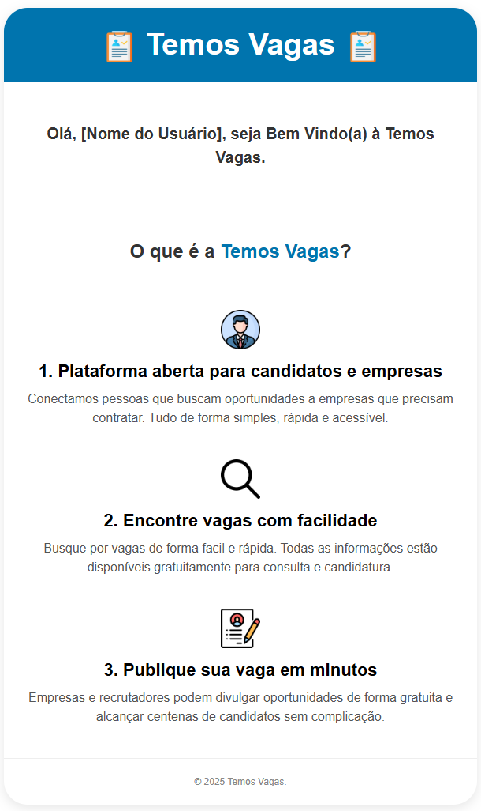
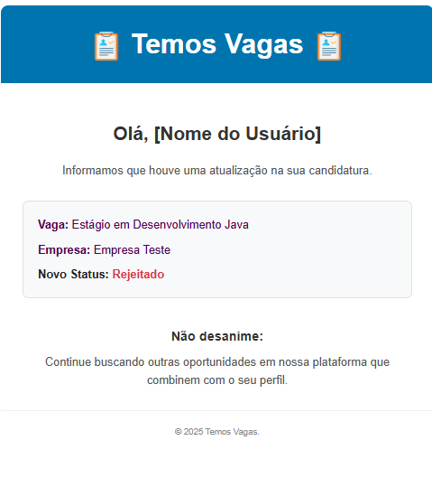
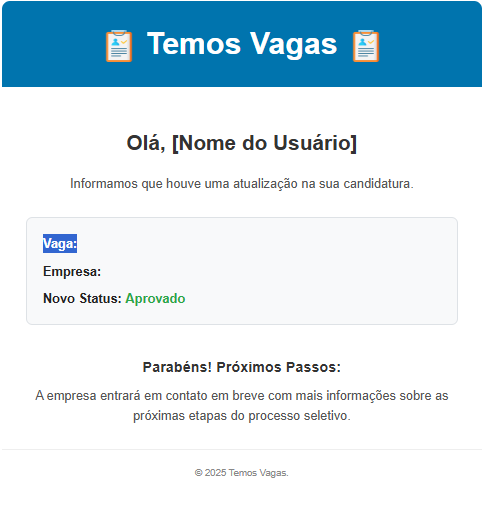
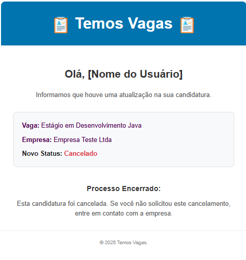

<center>

***

# Documentação: E-mail

</center>

A funcionalidade de envio de e-mails do projeto é implementada utilizando o **Spring Boot Mail** para a comunicação com o servidor SMTP e o **Thymeleaf** como motor de templates para gerar o conteúdo HTML dos e-mails. O envio é realizado de forma assíncrona para não impactar a performance da aplicação principal.

## 1. Configuração do Servidor de E-mail

As credenciais e detalhes de conexão com o servidor de e-mail estão centralizados no arquivo `application.properties`. O projeto está pré-configurado para utilizar o SMTP do Gmail.

**Arquivo**: application.properties

```properties
#Email
spring.mail.host=smtp.gmail.com
spring.mail.port=587
spring.mail.username=vagastemos72@gmail.com
spring.mail.password=senha
spring.mail.properties.mail.smtp.auth=true
spring.mail.properties.mail.smtp.starttls.enable=true
```

## 2. Serviço de E-mail (`EmailService`)

A classe `EmailService` é a responsavel pela funcionalidade e por toda a lógica de montagem e envio dos e-mails.

### Principais Componentes:

*   **`JavaMailSender`**: Component do Spring Mail para o envio de e-mails.
*   **`TemplateEngine`**: Componente do Thymeleaf responsável por processar os templates HTML e injetar os dados dinâmicos no html.

### Execução Assíncrona:

Para garantir que o envio de e-mails não bloqueie a excecução principal da aplicação (por exemplo, fazendo o usuário esperar o e-mail ser enviado para receber uma resposta da API), os métodos de envio são anotados com `@Async`.

Esta funcionalidade é habilitada pela anotação `@EnableAsync` na classe principal da aplicação, `TemosVagasApplication`.

## 3. Templates com Thymeleaf

O Thymeleaf é utilizado para separar o design do e-mail (HTML/CSS) da lógica da aplicação (Java).

*   **Templates**: Os arquivos de template são arquivos HTMLs que podem ser visualizados em um navegador.
*   **Integração codigo e html**: Permite o uso de lógica como condicionais (`if/else`) e laços de repetição diretamente no HTML.
*   **Integração com Spring**: A configuração é automática com o Spring Boot.

### Arquivos de Template

Os templates estão localizados em `templates` dentro da pasta `resources`:

*   **`templateEmailCadastro.html`**: E-mail de boas-vindas para novos usuários.
*   **`TemplateEmailAtualizacaoStatus.html`**: Notificação sobre alteração no status de uma candidatura a uma vaga.

### Exemplo de Template: `TemplateEmailAtualizacaoStatus.html`

Este template demonstra o uso de variáveis e lógica condicional.

```html
    <p>
        O status da sua candidatura para a vaga <strong th:text="${nomeVaga}">Nome da Vaga</strong>
        na empresa <strong th:text="${nomeEmpresa}">Nome da Empresa</strong>
        foi atualizado para: <strong th:text="${status}">Status</strong>.
    </p>

    <div th:switch="${status}">
        <p th:case="'APROVADO'">Parabéns! A empresa gostou do seu perfil e em breve entrará em contato.</p>
        <p th:case="'REPROVADO'">Infelizmente, não foi desta vez. Mas não desanime, continue tentando!</p>
        <!-- O '*' é o caso default, para qualquer outro status -->
        <p th:case="*">Continue acompanhando o processo seletivo pela nossa plataforma.</p>
    </div>

</html>
```

*   **`th:text="${nome}"`**: Substitui o conteúdo da tag `<strong>` pelo valor da variável `nome` passada pelo `EmailService`.
*   **`th:switch` / `th:case`**: Estrutura de controle que renderiza um parágrafo `<p>` diferente com base no valor da variável `status`.

## 4. Gatilhos de Envio de E-mail

Os e-mails são disparados a partir de outras classes de serviço em momentos chave da aplicação:

1.  **Cadastro de Usuário**:
    *   **Onde**: `CandidatoService`, no método `cadastrar`.
    *   **Ação**: Após salvar um novo candidato no banco de dados, ele chama o método `enviarEmailCadastro`.

2.  **Atualização de Status da Candidatura**:
    *   **Onde**: `AplicacaoService`, no método `atualizarStatusAplicacao`.
    *   **Ação**: Após atualizar o status de uma aplicação, ele chama o método `notificarMudancaStatus`, que por sua vez chama `enviarEmailAttStatus` para notificar o candidato.

---

## 5. Exemplos de E-mails Enviados

Abaixo estão exemplos visuais dos e-mails que são disparados pelo sistema.

### E-mail de Cadastro
<p align="center">
  
</p>

### E-mail de Status: Rejeitado
<p align="center">
  
</p>

### E-mail de Status: Aprovado
<p align="center">
  
</p>

### E-mail de Candidatura Cancelada
<p align="center">
  
</p>
